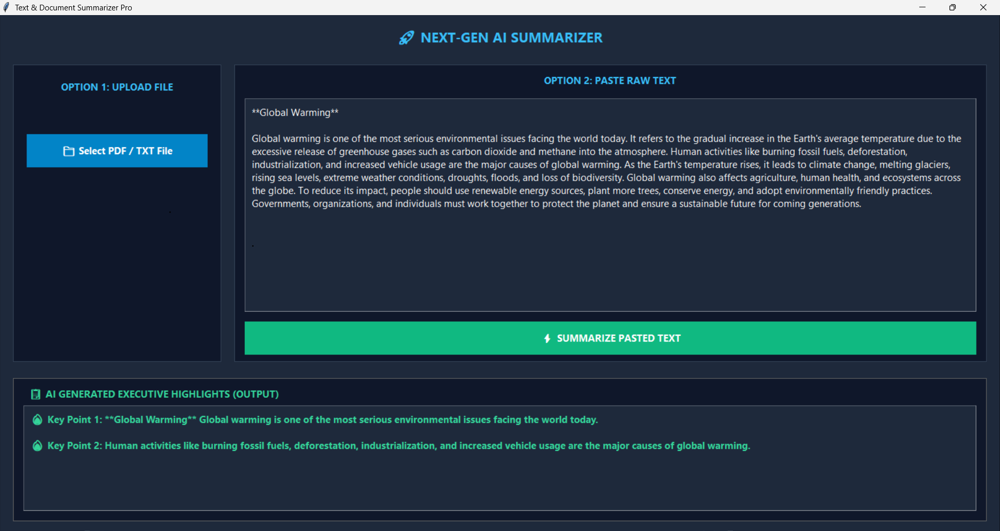

# 🚀 Next-Gen AI Text & Document Summarizer

A professional, lightweight Desktop GUI application built using Python and Tkinter that allows users to instantly summarize long English articles, paragraphs, or uploaded documents (`.txt` and `.pdf` files) into executive key highlights using an advanced internal frequency-scoring algorithm.

---

## ✨ Key Features
* **Dual Input System:** Paste raw text directly into the window or upload document files.
* **Smart File Parser:** Seamlessly reads and processes both `.txt` and `.pdf` documents.
* **Deterministic AI Engine:** Highly optimized word-frequency algorithm that guarantees summary output without crashing or lagging.
* **Premium Modern UI:** Built with a dark-mode theme utilizing high-contrast, professional visual hierarchy.

---

## 📸 Application Preview (Output Screenshot)

Here is the live execution preview of the summarizer engine:



> **Note:** Replace `output_screenshot.png` with the actual path/name of your saved image inside your repository.

---

## 🛠️ Tech Stack & Requirements
* **Language:** Python 3.10+
* **GUI Framework:** Tkinter (Built-in)
* **PDF Processing:** PyPDF2

### Installation

1. Clone or download this project repository to your local system.
2. Open your terminal or PowerShell inside the project folder and install the required PDF library:
   ```bash
   pip install PyPDF2
   🚀 How to Run the Project
Execute the main controller script using the following command in your terminal:

Bash
python summarizer.py
How to use it:
Using File Upload: Click on the "📁 Select PDF / TXT File" button on the left panel, select any English document, and the AI highlights will immediately appear in the output section.

Using Raw Text: Paste any long article inside the text area on the right panel and click the green "⚡ SUMMARIZE PASTED TEXT" button to view the results instantly.